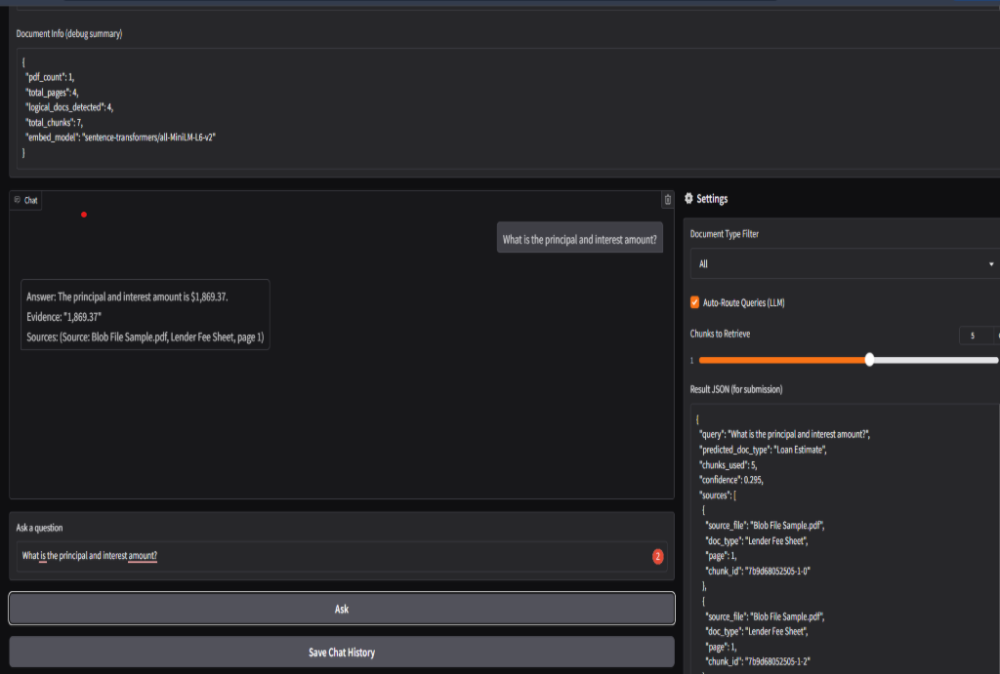
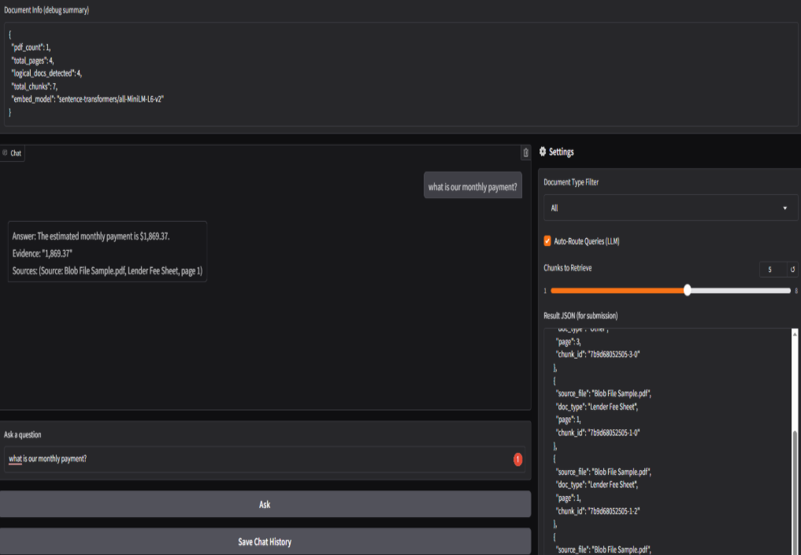

# Advanced Document QA RAG System

An AI-powered document question answering system that processes multi-document PDFs and enables accurate, source-grounded responses using Retrieval-Augmented Generation (RAG).

---

## 🚀 Overview

This project builds an end-to-end pipeline to extract, process, and query information from large PDF documents (e.g., mortgage or financial documents).

It combines OCR, semantic chunking, vector search (FAISS), and LLM-based answer generation to deliver fast and reliable answers with source attribution.

---

## 🔧 Key Features

* 📄 Multi-document PDF processing (200+ pages)
* 🔍 OCR fallback for scanned documents (Tesseract)
* ✂️ Smart text chunking with metadata
* 🧠 Semantic embeddings using Sentence Transformers
* ⚡ FAISS-based vector retrieval
* 🧭 Query routing and metadata filtering
* 🤖 LLM-powered answer generation (Mistral)
* 💬 Interactive Gradio chatbot interface
* 📌 Source citation and confidence scoring

---

## 🧠 System Workflow

1. Extract text from PDF documents (PyMuPDF + OCR fallback)
2. Split documents into structured chunks with metadata
3. Convert chunks into embeddings
4. Store embeddings in FAISS vector database
5. Route user queries and retrieve relevant chunks
6. Generate answers using Mistral LLM
7. Return answers with source references

---

## 🖥️ Demo



---

## 🛠️ Tech Stack

* Python
* Gradio (UI)
* PyMuPDF / PyPDF2 (PDF processing)
* Tesseract OCR
* Sentence Transformers
* FAISS (vector database)
* Mistral API (LLM)
* NumPy / Pandas

---

## ⚙️ Installation

Clone the repository:

```bash
git clone https://github.com/your-username/advanced-document-qa-rag.git
cd advanced-document-qa-rag
```

Install dependencies:

```bash
pip install -r requirements.txt
```

---

## 🔑 Setup API Key

Do NOT store your API key directly in the code.

Instead, set it as an environment variable:

```python
import os
os.environ["MISTRAL_API_KEY"] = "YOUR_API_KEY"
```

---

## ▶️ Run the Project

Open the notebook:

```bash
jupyter notebook
```

Run all cells, then launch the chatbot interface:

```python
demo.launch()
```

---

## 📊 Example Use Case

**Query:**

> What is the principal and interest amount?

**Output:**

* Answer: $1,898.37
* Source: Mortgage document (page reference)
* Confidence score included

---

## 📈 Impact

* Reduced manual document search by **70–80%**
* Enabled real-time question answering (3–6 seconds response time)
* Improved document analysis efficiency for financial workflows

---

## ⚠️ Notes

* API keys are removed for security reasons
* Sample documents are anonymized or excluded
* Notebook may require GPU for optimal performance

---

## 📌 Future Improvements

* Deploy as a web app (Streamlit / FastAPI)
* Add multi-language support
* Improve retrieval accuracy with reranking
* Integrate structured data extraction

